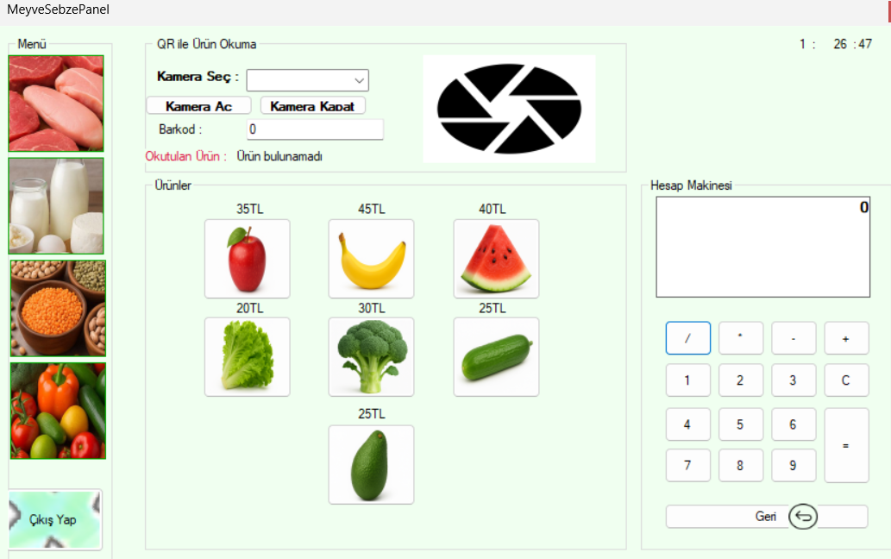

# Market Otomasyon Projesi

Bu proje, Windows Forms (WinForms) ile geliştirilen bir market yönetim sistemidir. Giriş paneli, kullanıcı rolleri (admin / kasiyer), ürün kategorileri (et, süt, baklagil, meyve-sebze vb.) ve güvenlik sorularıyla mail üzerinden şifre sıfırlama, barkod okutarak ürün adı ve fiyaı görüntüleme gibi temel özellikleri içerir.

## Özellikler

- Kullanıcı girişi (admin ve kasiyer yetkilendirmesi)
- Ürün yönetimi (ürün ekleme, silme, güncelleme)
- Personel yönetimi (kayıt ekleme, silme, güncelleme)
- Kategori bazlı panel ayrımı (Et Ürünleri, Süt Ürünleri, vb.)
- Kameradan barkod okutarak ürün adı ve fiyat bilgisi getirme
- Şifre sıfırlama (güvenlik sorusu üzerinden)
- Zaman göstergesi (panel üstü saat)

## Barkod Okuma Özelliği

Bu projede ZXing.NET ve AForge.NET kütüphaneleri entegre edilerek kamera üzerinden barkod okuma gerçekleştirilmiştir.  
Kullanıcı bir ürün barkodunu kameraya gösterdiğinde sistem otomatik olarak barkodu çözümler, veritabanındaki eşleşen ürünü bulur ve ürün adı ile fiyat bilgilerini arayüzde görüntüler.

## Teknolojiler

- C# .NET Framework 4.7.2
- Windows Forms (WinForms)
- SQL Server (Local)
- ZXing.NET (barkod desteği)
- AForge.NET (kamera desteği için)
- MSSQL (login ve ürün veritabanı)

## Kurulum

1. **Proje Çözümünü Açın**  
   Visual Studio ile `market.sln` dosyasını açın.

2. **Bağımlılıkları Yükleyin**  
   Gerekirse NuGet üzerinden `AForge`, `ZXing.Net` paketlerini kontrol edin.

3. **Veritabanı Bağlantısı**  
   `App.config` içindeki `connectionString` aşağıdaki gibi olmalıdır:

   ```xml
   <connectionStrings>
     <add name="MarketDB"
          connectionString="Data Source=.\SQLEXPRESS;Initial Catalog=market;Integrated Security=True"
          providerName="System.Data.SqlClient" />
   </connectionStrings>
   ```

4. **Veritabanını Oluşturun**  
   `SQL market` klasörü içindeki `.sql` dosyalarını kullanarak veritabanını oluşturun.

5. **Projeyi Çalıştırın**  
   `Form1` başlangıç formudur. F5 ile başlatabilirsiniz.
   Örnek barkodlara docs\Barkodlar sekmesinden ulaşabilirsiniz.


## Örnek Kullanıcılar

| Kullanıcı Adı | Şifre     | Yetki   |
|---------------|-----------|---------|
| sevval        | 555       | admin   |
| veli          | 111       | kasiyer |

## Katkı Sağlamak

Her türlü katkıya açıktır. Fork'layın, geliştirin, pull request gönderin!

## Lisans

Bu proje bireysel eğitim amaçlıdır. Ticari kullanım için uygun değildir.

## Ekran Görüntüleri

### Kasap Reyonu


### Kasiyer Paneli


### Meyve-Sebze Reyonu


### Personel İşlemleri


### Şifre Değiştirme Ekranı


### Süt Ürünleri


### Ürün İşlemleri

